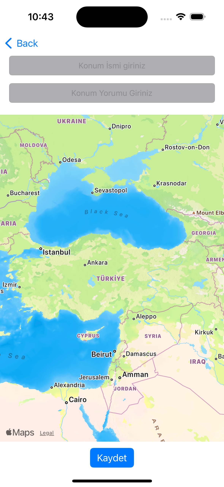
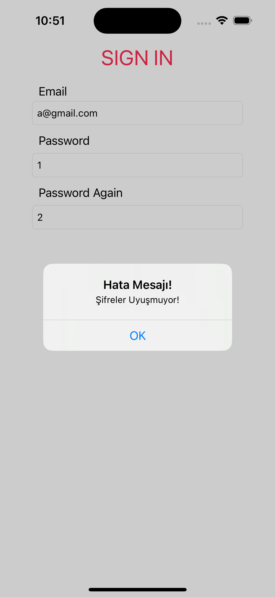
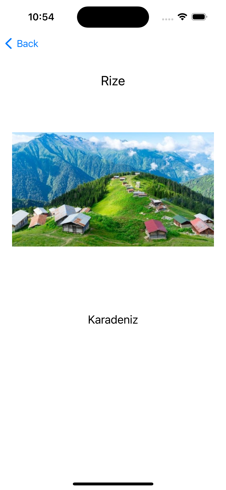

# BTK-Akademi-Alistirmalar-Atil-SAMANCIOGLU-Swift-ile-IOS_Programlama

# iOS  Alıştırmalar 💻

- IOS developer olma sürecinde ilk olarak BTK Akademi sitesinde bulunan Atil SAMANCIOGLU-Swift ile IOS Programlama dersleri ile başladım. Eğitimi bitirirken bu alanda çalışırken aldığım zevkin farkına vardım ve bu yönde kendimi geliştirme kararı aldım.

    
   

Swift, benim için büyük ilgi uyandıran bir programlama dilidir. Özellikle iOS, iPadOS, macOS, tvOS ve watchOS gibi Apple platformlarında kullanılabilmesi büyük bir kolaylık sağlıyor.  Söz dizimi kısa ve anlamlı olduğu için kod yazarken daha az çaba harcamamı sağlıyor.

Swift, geliştiricilere modern programlama dilinin tüm avantajlarını sunuyor. Fonksiyonel ve nesne yönelimli programlama yetenekleri gibi modern özellikleri içeriyor. Bu, geliştiricilerin daha temiz ve düzenli kod yazmalarını kolaylaştırırken, aynı zamanda hızlı ve verimli uygulamalar geliştirmelerine olanak tanır.

En önemlisi, Swift kodu tasarımı gereği güvenli ve güvenilirdir. Dil, tip güvenliği ve güçlü hata denetimi gibi özelliklerle donatılmıştır, bu da programcıların hataları önlemesine ve daha güvenilir yazılımlar oluşturmasına yardımcı olmaktadır. Ayrıca, Swift'in performansı da etkileyici. Hızlı çalışma zamanı beni cezbeden bir diğer alan olmuştur.

Sonuç olarak, Swift programlama dili beni etkileyen güçlü ve sezgisel bir dil. Hem modern özellikleri hem de güvenliği ile geliştiriciler için ideal bir seçenek. Bu nedenle Swift'i öğrenmek ve kullanmak gerçekten heyecan verici bir deneyim olabilir.

## Projenin Amacı ⁉️

Swift ile ilgili temel konuları not alarak ve örneklerle bu işlemi pekiştirmek adına yaptığım bir çalışmadır. Öğrendiklerimi pekiştirmek, farklı projeler geliştirmek amacıyla oluşturulmuş bir bulunmaktayım.

## Proje İçeriği 🎁

Swift ile geliştirilmiş başlangıç seviyesinde OOP mantığını kavramak, XCode üzerinde etkinliğimi arttırmak ve Swift diline başlangıç yaptığım bir alıştırmalar bütünüdür. Playground ve İOS projelerinin bulunduğu bir projedir.

